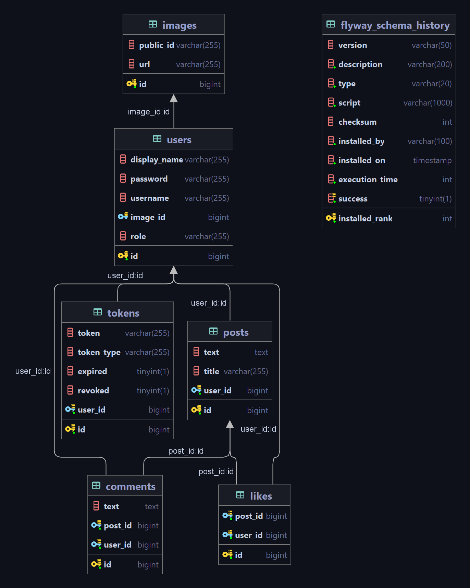

# Project Description :clipboard:

This is an application built by Spring Boot. Users can register and login to the application. Json Web Token is used for authentication. Logged in users can share a post, comment on a post and like a post. Users can add a profile picture. The pictures are stored in Cloudinary service. Every month the app generates a report with users' information and stores it in the Cloudinary service.

## Tools and Technologies 💻

- Spring Boot 3
- Spring Data JPA
- Java 17
- Maven
- JWT
- MySQL
- Flyway
- Open API Documentation
- Resilience4j
- JasperReports
- Cloudinary
- Docker

## Database Diagram :pushpin:

